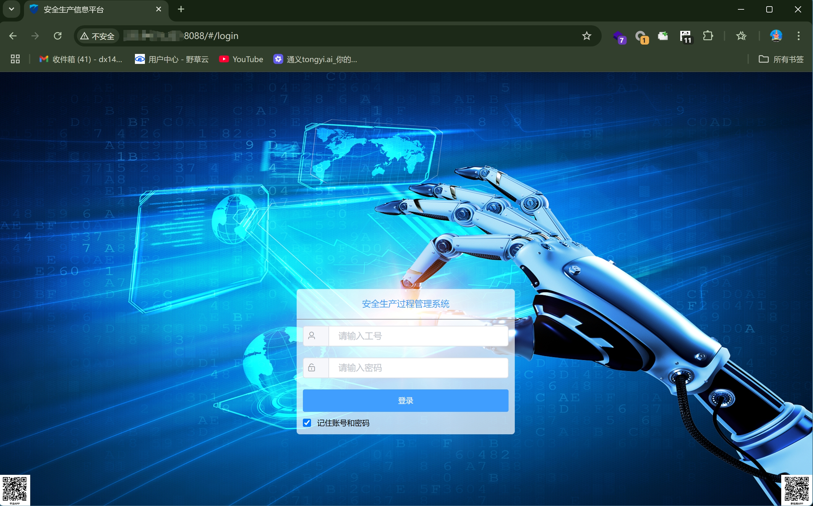
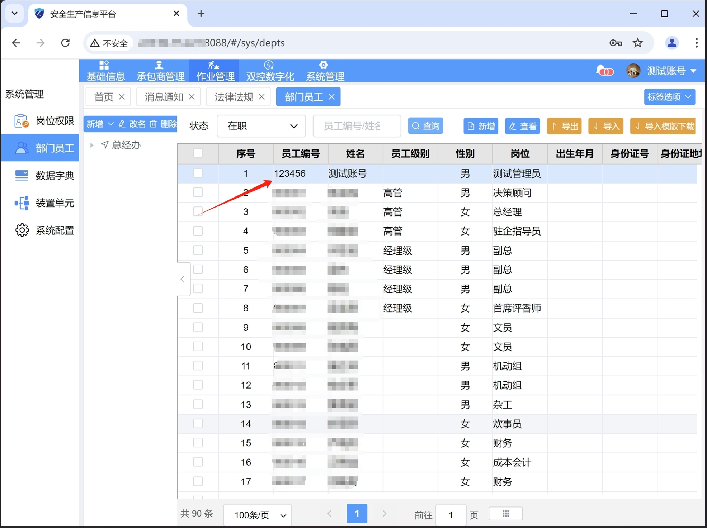

# Weak Password vulnerability in Safety production process management system

### 企业官网(Enterprise official website)：

http://www.hzzcka.com/

### 危害描述(Vulnerability description)：

**Weak Password vulnerability** May lead to unauthorized access, data breaches, identity theft, and further network attacks, posing a serious threat to the security of individuals and organizations.

### 漏洞细节(Vulnerability details)：
#### version:  Safety-production-process-management-system 1.0
```
Username:123456
Password:666666
```
Login page

Admin panel


### 修复建议(Repair suggestion)：

**Remediation suggestions** Use complex passwords, regularly change passwords, and add additional authentication methods.

